  

  AI Developer specializing in Deep Neural Networks, Generative AI, and Agentic Solutions. Building the future, one model at a time.

  

- 🌐 Portfolio: **[ghelanikirtan.vercel.app 🔗](https://ghelanikirtan.vercel.app/)**
- 🧑‍💻 Currently working on: AI-ML (Neural Networks, Generative AI, & so on), Gen AI & Agentic AI Solutions.
- 💬 Ask me about: Programming, tech, and Artificial Intelligence.
- 📫 Email: **[kghelani.dev@gmail.com](mailto:kghelani.dev@gmail.com)** for collaborations.

# 💻 Tech Stack:

<h4> Programming Languages: </h4>

  
  
  
  
  
  
  

<h4>DS & AI/ML Frameworks:</h4>

  
  
  
  
  
  
  
  
  
  
  
  

<h4>Development:</h4>

  
  
  
  
  
  
  
  

<h4>Database:</h4>

  
  
  
  

<h4>Others:</h4>

  
  
  
  
  
  
  
  

# 📊 GitHub Stats:

  

  
  

  

# 🤝 Let's connect:

  
  
  

